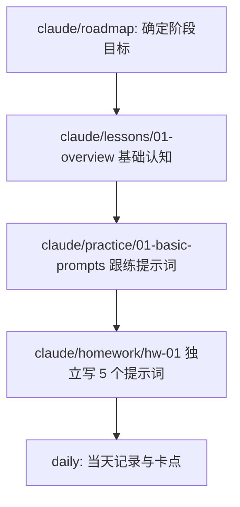

# 学习路径说明

本文件说明在本仓库中如何完成一次完整学习闭环。

## 目录结构

按**主题**组织，每个主题一个顶层目录，内部子目录结构一致：

```
{topic}/
├── roadmap/       # 阶段目标与范围
├── lessons/       # 系统讲解
├── practice/      # 跟练
├── homework/      # 独立作业
├── prompts/       # 提示词沉淀
└── resources/     # 收藏资料
```

全局目录（跨主题）：`daily/`（每日记录）、`review/`（复盘）

当前已有主题：`claude/`、`rtk/`

## 最小路径（建议新手）

1. `{topic}/roadmap/`：写清楚今天学什么
2. `{topic}/lessons/`：输出讲解内容
3. `{topic}/practice/`：跟练并验证理解
4. `daily/`：记录当天收获与卡点

## 完整路径（进阶）

1. `{topic}/roadmap/`：阶段目标与范围
2. `{topic}/lessons/`：系统讲解与示例
3. `{topic}/practice/`：小步练习
4. `{topic}/homework/`：独立作业检验
5. `review/`：复盘与调整
6. `daily/`：每天记录

## 一次学习的最小模板

- `{topic}/roadmap/plan.md`：今天要学什么
- `{topic}/lessons/01-topic.md`：讲解内容
- `{topic}/practice/01-task.md`：跟练
- `daily/YYYY-MM-DD.md`：当天记录

## Claude 学习（阶段 1）示例流程

基础认知：理解 Claude 定位与边界，学会提出清晰问题，掌握提示词结构（角色 + 任务 + 约束 + 示例）。


